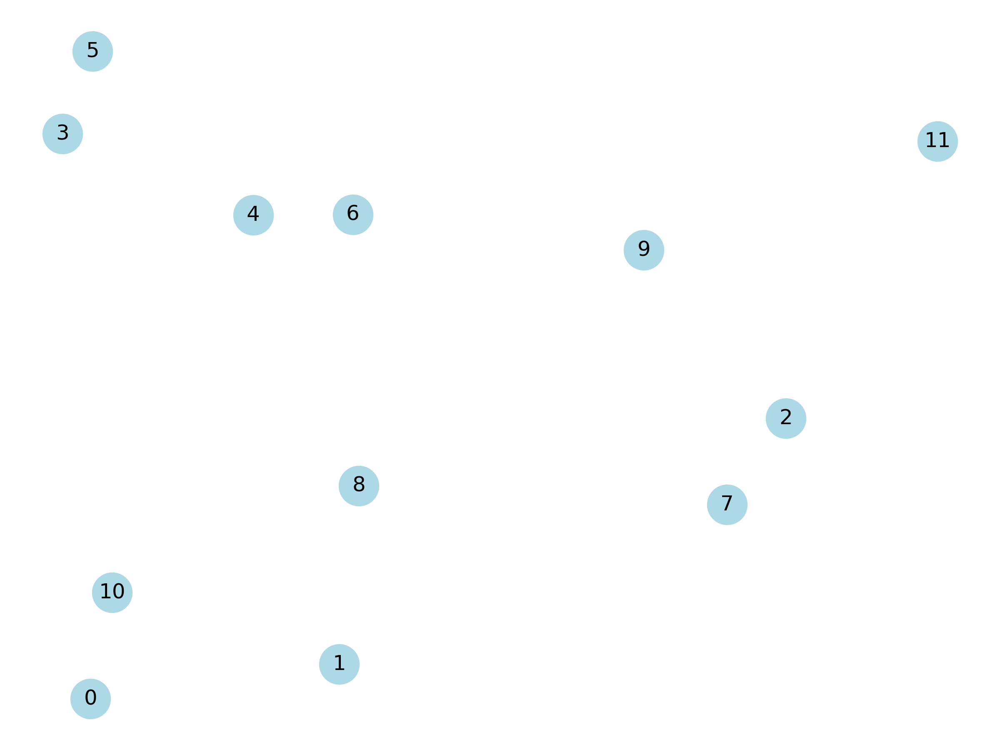
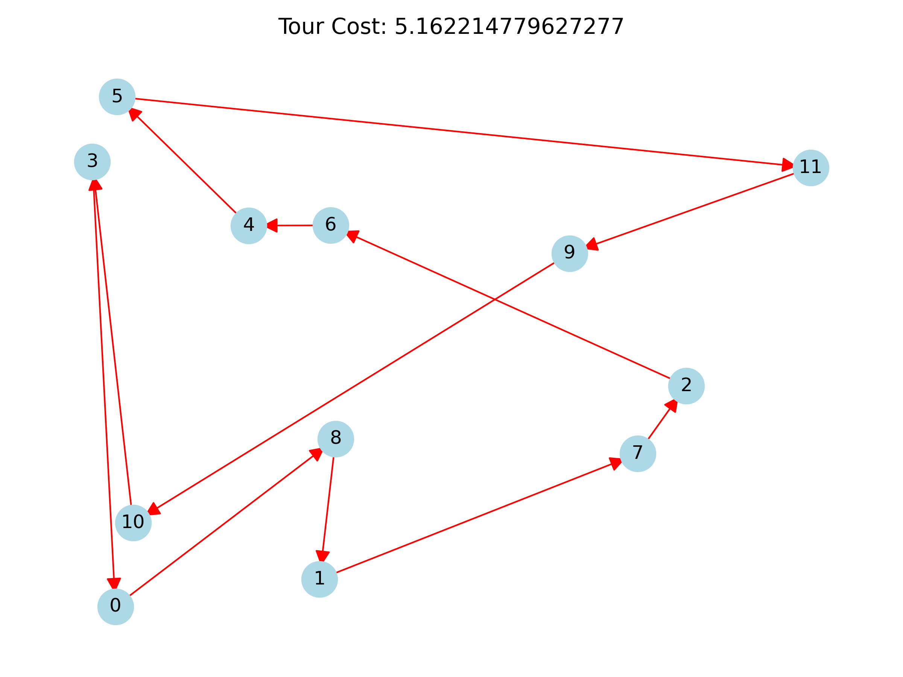
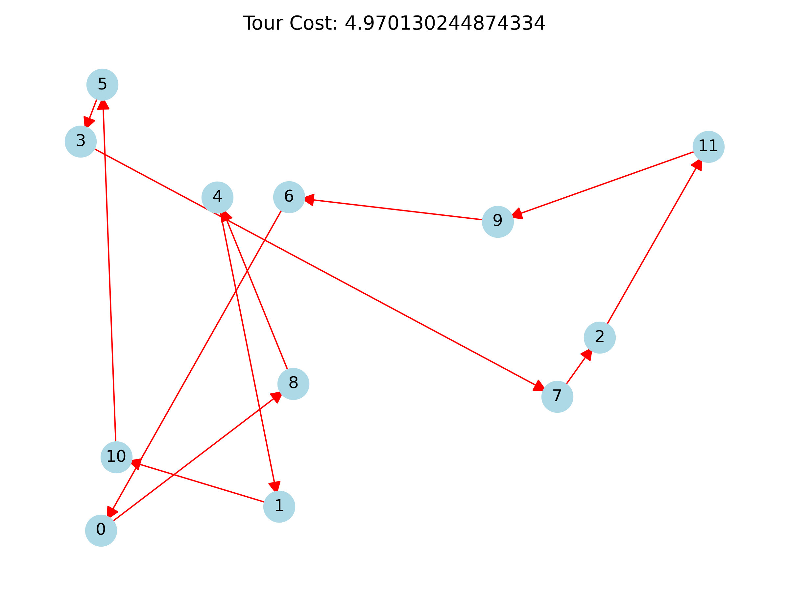
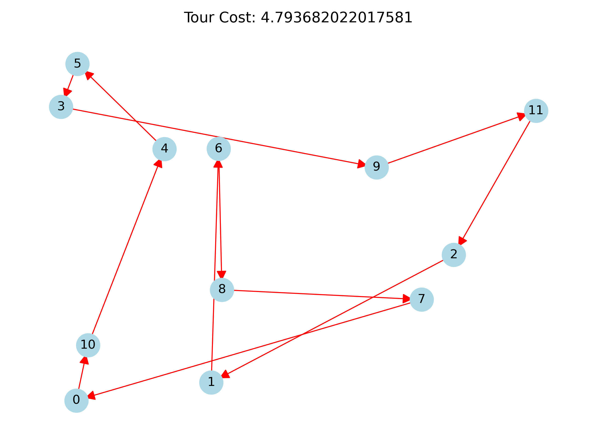

# Simulated Annealing for QUBOs

This repo contains a simulated annealing algorithm to solve QUBOs.


## Python Code

See `python/build/qubo_solver.py` for our implementation in Python. See
`python/unit_test.py` for unit tests to check your Python build. Finally, see
`python/examples` for examples of the solver in action.

### Requirements:

The Python build code requires NumPy and was tested on Python 3.12.

### Input:

Each problem instance requires four arguments:

```
Q (n x n matrix): Quadratic matrix representing your problem.

num_res (integer): Number of desired restarts.

num_iters (integer): Number of iterations per restart.

beta_sched (1 x n matrix): 1/temperate schedule for each iteration.

```

### Output:

Given the input arguments defined above, the solver outputs the
solution with the minimum energy found in anneal.

## Example: TSP

The traveling salesman problem can be modelled by the following QUBO. Given
a set of $n$ cities, let $x_{i,j}$ be equal to 1 if city $i$ is
the $j$th city visited in the tour and 0 otherwise. Any feasible tour
must satisfy the following two constraints:

1. $\sum_{i=0}^{n-1} (1 - \sum_{j=0}^{n-1} x_{i,j})^2 = 0$
   (each city is visited exactly once) and
2. $\sum_{j=0}^{n-1} (1 - \sum_{i=0}^{n-1} x_{i,j})^2 = 0$
   (one city is visited per tour step).

Given two cities $u$ and $v$, let $D(u, v)$ denote the distance between
$u$ and $v$. The total cost of a tour is the sum of the travelled distances:

$$
\displaystyle\sum_{0 \le u \neq v \le n-1} D(u,v) \sum_{j=0}^{n-1}
x_{u,j}x_{v,j+1}
$$

where $j+1$ is taken modulo $n$. To formulate this problem as a QUBO,
define the following objective function

$$
f:= P\displaystyle\sum_{i=0}^{n-1} \Big(1 - \sum_{j=0}^{n-1} x_{i,j}\Big)^2 +
P\displaystyle\sum_{j=0}^{n-1} \Big(1 - \sum_{i=0}^{n-1} x_{i,j}\Big)^2 +
\displaystyle\sum_{0 \le u \neq v \le n-1} D(u,v) \sum_{j=0}^{n-1}
x_{u,j}x_{v,j+1}
$$

where $P$ is the penalty assigned to any tour that does not satisfy constraints
1 or 2. Let $D_{max}$ and $D_{min}$ be the maximum and minimum distances,
respectively, between cities in a given problem instance. By letting $P =
n(D_{max} - D_{min})+ 1$, we ensure that any possible tour assignment that does
not satisfy constraints 1 or 2 has an objective value at least $nD_{max} + 1$.

See `python/examples/tsp.py` for code that takes an instance of a TSP and
creates the Quadratix matrix $Q$ that represents the quadratic terms in $f$.
See `python/examples/tsp_example.py` for an example simulated anneal of a
TSP instance of the following 12 cities.

<p align="center">

</p>

With num_res = 1 and num_iters = 10, we obtain the following solution.
<p align="center">

</p>

With num_res = 10 and num_iters = 100, we obtain the following solution.
<p align="center">

</p>

With num_res = 10 and num_iters = 1000, we obtain the following solution.
<p align="center">

</p>
