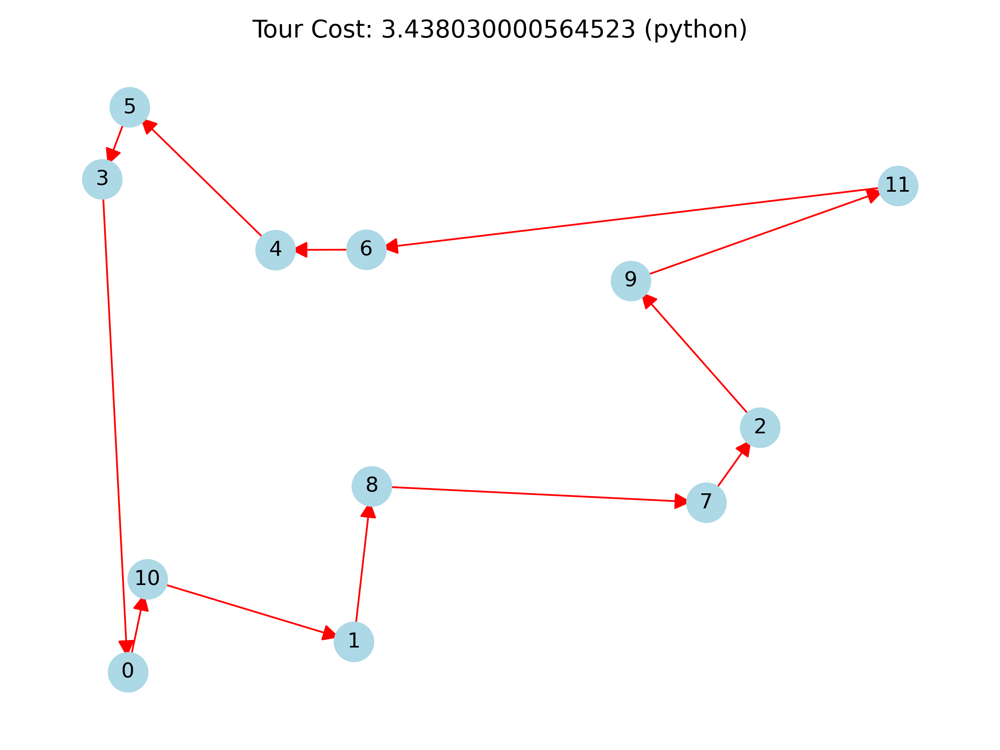

# Example: TSP

The traveling salesman problem can be modelled by the following QUBO. Given
a set of $n$ cities, let $x_{i,j}$ be equal to 1 if city $i$ is
the $j$ th city visited in the tour and 0 otherwise.

## Constraints:

Any feasible tour
must satisfy the following two constraints:

1. $\sum_{i=0}^{n-1} (1 - \sum_{j=0}^{n-1} x_{i,j})^2 = 0$
   (each city is visited exactly once) and
2. $\sum_{j=0}^{n-1} (1 - \sum_{i=0}^{n-1} x_{i,j})^2 = 0$
   (one city is visited per tour step).

Given two cities $u$ and $v$, let $D(u, v)$ denote the distance between
$u$ and $v$. The total cost of a tour is the sum of the travelled distances:

$$
\displaystyle\sum_{0 \le u \neq v \le n-1} D(u,v) \sum_{j=0}^{n-1}
x_{u,j}x_{v,j+1}
$$

where $j+1$ is taken modulo $n$.

## QUBO objective function:

To formulate this problem as a QUBO,
define the following objective function

$$
f:= P\displaystyle\sum_{i=0}^{n-1} \Big(1 - \sum_{j=0}^{n-1} x_{i,j}\Big)^2 +
P\displaystyle\sum_{j=0}^{n-1} \Big(1 - \sum_{i=0}^{n-1} x_{i,j}\Big)^2 +
\displaystyle\sum_{0 \le u \neq v \le n-1} D(u,v) \sum_{j=0}^{n-1}
x_{u,j}x_{v,j+1}
$$

where $P$ is the penalty assigned to any tour that does not satisfy constraints
1 or 2. Let $D_{max}$ and $D_{min}$ be the maximum and minimum distances,
respectively, between cities in a given problem instance. By letting $P =
n(D_{max} - D_{min})+ 1$, we ensure that any possible tour assignment that does
not satisfy constraints 1 or 2 has an objective value at least $nD_{max} + 1$.

## Example:

### Requirements:
To run any of the code in this directory, you will need `matplotlib` (tested on
3.10.3), `networkx` (tested on 3.4.2), and `numpy` (tested on 2.3.0).

### Code:

The file `generate_tsp_matrix.py` can be used to generate a QUBO matrix (as
formulated above) given an instance of a TSP defined by $n$ cities and a $(n
\times n)$ numpy array of `np.float64` such that the element in row $u$ and
column $v$ corresponds with $D(u,v)$. The file `generate_tsp_instance.py` can
be used to generate a random TSP instance. The directory `problem_instance/`
contains a random TSP instance on 12 cities with the following files.

```
1. run_data <- {# of variables in model} {# of restarts} {# of iterations}.
2. distances <- distance between cities in matrix form.
3. x_cor, y_cor <- horizontal and vertical coordinates of cities.
4. beta_schedule <- beta value per iteration.
5. beta_and_temperature.png <- visual of beta and temperature schedule.
6. QUBO_matrix <- matrix obtained from generate_tsp_matrix given TSP instance.
7. tsp_instance.png <- visual of cities embedded on a plane.
```
A visual of the cities in `problem_instance/` is shown below.

<p align="center">

</p>

This TSP instance has been solved with both the Python and C++ implementations.
The solutions can be found in `../../python/examples/tsp/output/` and
`../../cpp/examples/tsp/output/`, respectively. The file `read_solutions.py`
can be used to generate the following visuals of these solutions.

<p align="center">


</p>
